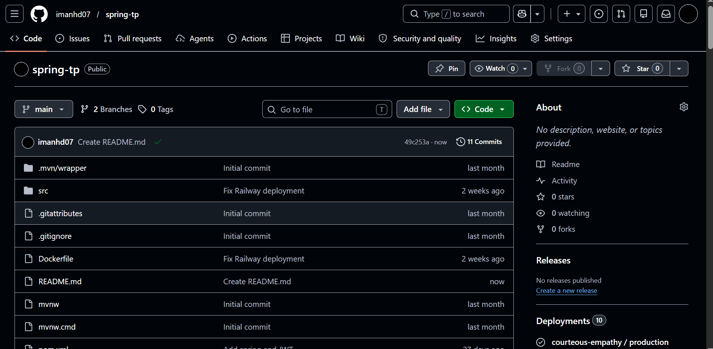
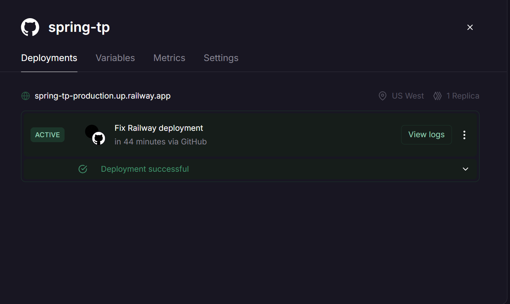

# Application de Gestion des Produits et Articles

## Informations de l'Étudiante

- **Nom :** Oumoukelthoum Elheda
- **Matricule :** C27828
- **Filière :** DA2I

---

# Description du Projet

Cette application web a été développée avec **Spring Boot**.

Le projet permet la gestion des produits et des articles à travers une interface web simple et intuitive. Il met en œuvre les concepts étudiés en cours tels que Spring MVC, Spring Data JPA, Hibernate, Thymeleaf et le déploiement Cloud.

---

# Technologies Utilisées

- Java 
- Spring Boot 
- Spring MVC
- Spring Data JPA
- Hibernate
- Thymeleaf
- Maven
- Base de données H2
- Git & GitHub
- Railway

---

# Fonctionnalités

## Gestion des Produits

- Affichage de la liste des produits
- Ajout d’un nouveau produit
- Stockage des données dans la base de données

## Gestion des Articles

- Affichage des articles
- Ajout d’articles
- Gestion des informations des articles

---

# Architecture du Projet

```text
src
├── main
│   ├── java
│   ├── resources
│   ├── templates
│   └── static
├── test
└── pom.xml
```

---

# Exécution en Local

### Cloner le dépôt

```bash
git clone https://github.com/imanhd07/spring-tp.git
```

### Accéder au projet

```bash
cd spring-tp
```

### Lancer l'application

```bash
./mvnw spring-boot:run
```

L'application sera accessible à l'adresse :

```text
http://localhost:8080
```

---

# Déploiement sur Railway

L'application a été déployée avec succès sur la plateforme Railway.

### URL de Production

https://spring-tp-production.up.railway.app

---

# Comparaison : Des plateformes de déploiement

| Critère | Railway | Render | Vercel |
|----------|----------|----------|----------|
| Facilité d'utilisation | Très facile | Facile | Très facile |
| Intégration GitHub | Oui | Oui | Oui |
| Support Spring Boot | Oui | Oui | Limité |
| Support des bases de données | Oui | Oui | Non |
| Déploiement automatique | Oui | Oui | Oui |
| Version gratuite | Limitée | Limitée | Limitée |
| URL publique | Oui | Oui | Oui |
| Adapté à ce projet | Très adapté | Adapté | Peu adapté |


# Analyse

Le déploiement sur Railway est plus adapté à la mise en production car il permet :

- Un accès public à l'application.
- Une intégration avec GitHub.
- Un déploiement automatique après chaque mise à jour.
- Une meilleure disponibilité.
- Une configuration rapide et facile.

Pour ces raisons, Railway a été choisi comme plateforme de déploiement.

---

# Dépôt GitHub

Lien du projet :

https://github.com/imanhd07/spring-tp

---

# Captures d'Écran

## Dépôt GitHub



---

## Déploiement Railway



## Interface de Gestion des Produits

Capture montrant le catalogue des produits et l'ajout de nouveaux produits.

## Déploiement Railway

Capture montrant le succès du déploiement de l'application sur Railway.

---

# Conclusion

Ce projet a permis de mettre en pratique les technologies Spring Boot pour le développement d'une application web complète.

Il combine :

- Développement Backend avec Spring Boot.
- Gestion de base de données avec JPA et Hibernate.
- Création d'interfaces web avec Thymeleaf.
- Gestion de versions avec GitHub.
- Déploiement Cloud avec Railway.

Cette réalisation constitue une application web fonctionnelle respectant les bonnes pratiques du développement moderne.
